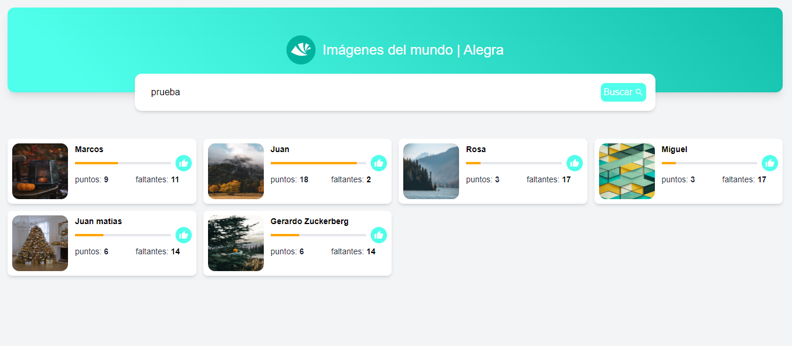
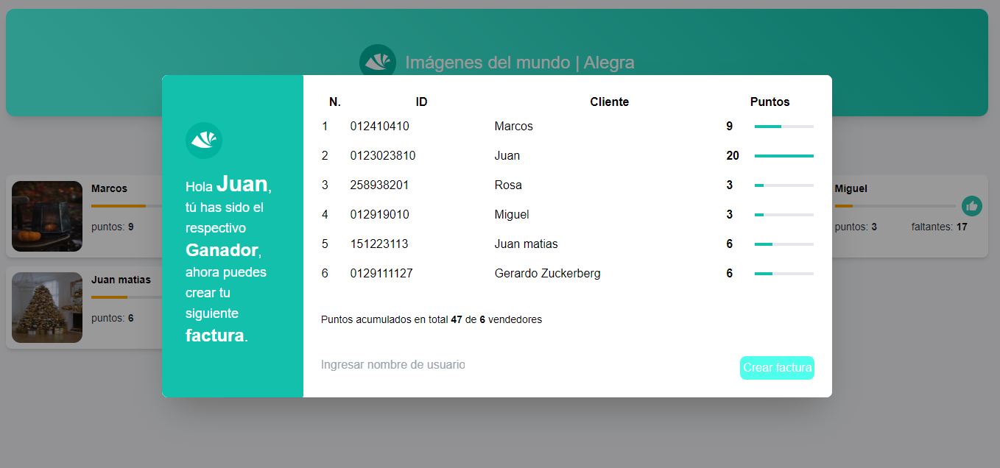

<p align="center">

</p>

<h1>
<p align="center">
  Imágenes del mundo - Alegra
</p>
</h1>

<p align="center">


</p>

[Ver demo](https://main.d3i8o9r76xprsx.amplifyapp.com/)

## Descripción 🚀

Para llevar a cabo este proyecto se realizó bocetos y la identificación del flujo más optimo que debe realizar el usuario mediante distintos recursos como Medium, Dev.To, Pinteret, Dribbble.

Con respecto a la arquitectura de la aplicación, se optó por un modelo basado en _features_ ya que permite separar la estructura en distintas capas y funcionalidades de acuerdo a lo que se requiere permitiendo escalar con mayor facilidad y en caso de subdivir aplicaciones solo sería necesario desacoplar cierta parte de si misma.

El desarrollo fué implementado teniendo en cuenta los siguientes puntos:

- Accesibilidad
- UX
- Mantenibilidad
- Escalabilidad
- Calidad
- Arquitectura

La estructura de la aplicación es la siguiente:

- app: Punto de entrada para la aplicación en general.
- config: Configuraciones generales para varias fuentes de datos externas o variables de entorno.
- router: Carpeta para crear las rutas de toda la aplicación.
- mocks: Aveces se desea tener datos para poder realizar pruebas de recursos externos, esta carpeta esta diseñada para cumplir con tal función.
- core: Carpeta destinada a manipular fuente de datos externa o archivos que personalizan la aplicación para que pueda funcionar.
- shared: Recurso de componentes, utilidades que son responsables de la UI, sin mayor lógica de negocio.
- features: Cada carpeta es independiente pero puede compartir funcionalidades con otros módulos. Una de las principales ventajas con este enfoque es que tenemos un conjunto de funcionalidades que construyen una funcionalidad en particular, teniendo la habilidad de escalar independientemente. Cada feature tiene sus propios componentes, secciones, manejador de estado, utilidades, etc.

```
├───app
├───config
├───router
├───mocks
├───core
│   └───i18n
│   ├───models
│   ├───services
│   ├───lib
│   └───styles
├───features
│   ├───application
│   ├───invoiceCreated
│   ├───newInvoice
│   ├───searchImages
│   │   ├───composables
│   │   ├───components
│   │   ├───sections
│   │   ├───store
│   │   └───utils.ts
│   │   └───types.ts
│   │   └───constants.ts
│   │   └───SearchImages.vue
├───shared
│   ├───components
│   │   ├───ui
│   │   ├───product
│   │   ├───seller
│   ├───composables
│   ├───constants
│   ├───types
│   └───utils
```

## Pre-requisitos 📋

Para comenzar el programa, es necesario tener instalado Node>=14.

- [Node](https://nodejs.org/en/download/)

## Tecnologías 🛠️

Las principales tecnologías usadas para la implementación del proyecto son las siguientes:


- Framework: **Vue 3**
- Estilos: **TailwindCSS, Sass**
- Fechas: **DayJs**
- State management: **Pinia**
- Lenguage principal: **Typescript**
- Llamadas API: **Axios**
- Calidad de código en desarrollo: **Prettier, Eslint, Husky, Commitlint**

## Uso ⚙️

Los siguientes comandos han de ser ejecutados dentro de la carpeta del proyecto.

**Uso con npm**

Antes de poder usar el proyecto es necesario instalar las dependencias.

```console
$ npm install
```

Para poder ver el funcionamiento en desarrollo ejecutar el siguiente comando.

```console
$ npm run dev
```

Finalmente para poder construir la aplicación utilize el siguiente comando que creará una carpeta **dist** done estará todo el código listo para producción.

```console
$ npm run build
```

## Consideraciones 🙌

- Google Images API no permite traer imagenes de cliente, por ese motivo se uso la API de [Unsplash](https://unsplash.com/) con la misma funcionalidad [https://unsplash.com/developers](https://unsplash.com/developers).

- El API de Alegra bloquea peticiones de un dominio externo de cliente 🙁, es por ese motivo que se usó [ChanceJs](https://chancejs.com/) para simular datos reales y son cargados asíncronamente con el fin de no afectar el rendimiento.

  Código de ejemplo:

  ```ts
  import { alegraApi } from "@/config/api";
  import type { Seller } from "@/core/models/seller";
  import { importServiceMock } from "@/mocks/utils";

  export const getAllSellers = async () => {
    try {
      return await alegraApi.get<Seller[]>("/v1/seller");
    } catch {
      // returning async mock data
      return importServiceMock(() => import("@/mocks/sellers.mock"));
    }
  };
  ```

- La arquitectura de la aplicación esta basada en un modelo escalable que permite la incorporación de nuevas funcionalidades y manteniblidad en el futuro.

- Las variables de entorno fueron subidas al repositorio en caso de querer realizarse las pruebas de manera local, aunque en una aplicación real esto no es lo recomendado.

## Funcionalidades desarrolladas 💻

- [x] Poder buscar imagenes y mostrarlas en conjunto con los vendedores.
- [x] Poder seleccionar las fotografias de cada vendedor dandole like e incrementar su puntaje.
- [x] Deshabilitar la opción para seleccionar las imagenes una vez alguien obtiene el puntaje de **20**.
- [x] Mostrar detalle del puntaje total y por cada vendedor.
- [x] Permitir crear una nueva factura por el vendedor ganador.
- [x] Asociar un cliente y seleccionar productos.
- [x] Previsualizar la imagen del vendedor en pantalla completa.
- [x] Mostrar factura creada.
- [x] Cambiar a multiples idiomas.

##

#### **_💫😊 Gracias por el reto!, disfruté mucho desarrollando la aplicación, espero que sea de su agrado navegando y espero con ansias formar parte de Alegra 😊💫_**
