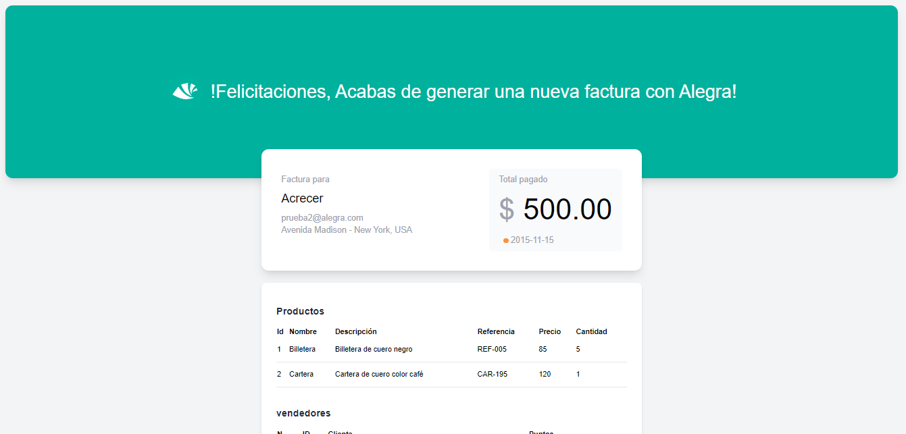

<p align="center">

</p>

<h1>
<p align="center">
  Imágenes del mundo - Alegra
</p>
</h1>

<p align="center">


</p>

[Ver demo](https://frontend-alegra-challenge.netlify.app)

## Descripción 🚀

Para llevar a cabo este proyecto se realizó bocetos y la identificación del flujo más optimo que debe realizar el usuario mediante distintos recursos como Medium, Dev.To, Pinteres, Dribbble.

Con respecto a la arquitectura de la aplicación, se optó por un modelo basado en _features_ ya que permite separar la aplicación en distintas capas y funcionalidades de acuerdo a lo que se requiere permitiendo escalar la aplicación con mayor facilidad y en caso de subdivir aplicaciones solo sería necesario desacoplar cierta parte de la app.

La estructura de la aplicación es la siguiente:

```
├───app
├───config
├───router
├───mocks
├───core
│   └───i18n
│   ├───models
│   ├───services
│   └───styles
├───features
│   ├───application
│   ├───invoiceCreated
│   ├───newInvoice
│   ├───searchImages
│   │   ├───composables
│   │   ├───components
│   │   ├───sections
│   │   ├───store
│   │   └───utils.ts
│   │   └───types.ts
│   │   └───constants.ts
│   │   └───SearchImages.vue
├───shared
│   ├───components
│   │   ├───ui
│   │   ├───product
│   │   ├───seller
│   ├───composables
│   ├───types
│   └───utils
```

## Pre-requisitos 📋

Para comenzar el programa, es necesario tener instalado Node>=14.

- [Node](https://nodejs.org/en/download/)

## Tecnologías 🛠️

Las principales tecnologías usadas para la implementación del proyecto son las siguientes:

- Framework: **Vue 3**
- Estilos: **TailwindCSS, Sass**
- Fechas: **DayJs**
- State management: **Pinia**
- Lenguage principal: **Typescript**
- Llamadas API: **Axios**
- Calidad de código en desarrollo: **Prettier, Eslint, Husky, Commitlint**

## Uso ⚙️

Los siguientes comandos han de ser ejecutados dentro de la carpeta del proyecto.

**Uso con npm**

Antes de poder usar el proyecto es necesario instalar las dependencias.

```console
$ npm install
```

Para poder ver el funcionamiento en desarrollo ejecutar el siguiente comando.

```console
$ npm run dev
```

Finalmente para poder construir la aplicación utilize el siguiente comando que creará una carpeta **build** done estará todo el código listo para producción.

```console
$ npm run build
```

## Consideraciones 🙌

- Los sistemas de API cuentan con un sistema que captura datos que son falsos por motivos de prueba y ciertas restricciones al integrar el API.
- La arquitectura de la aplicación esta basada en un modelo escalable que permite la incorporación de nuevas funcionalidades y manteniblidad en el futuro.
- Las variables de entorno fueron subidas al repositorio en caso de querer realizarse las pruebas de manera local.
- Correo y contraseña de la cuenta de Alegra:
  - **jhonyvega.dev@gmail.com**
  - **jhonyvegadev**

## Funcionalidades desarrolladas 💻

- [x] Poder buscar imagenes y mostrarlas en conjunto con los vendedores.
- [x] Poder dar like a las fotografias de cada vendedor.
- [x] Deshabilitar la opción para seleccionar las imagenes una vez alguien obtiene el puntaje de **20**.
- [x] Mostrar detalle del puntaje total y por cada vendedor.
- [x] Permitir crear una nueva factura al vendedor.
- [x] Mostrar factura creada.
